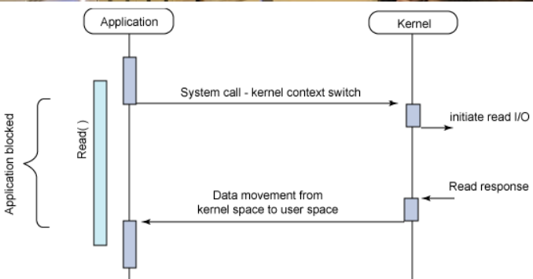
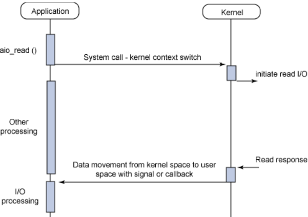
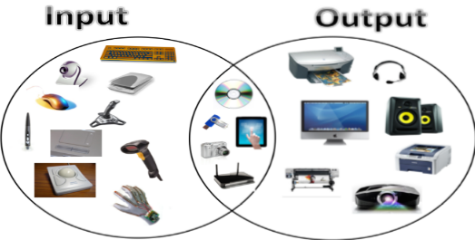
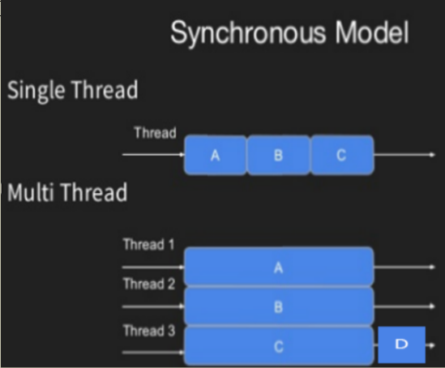
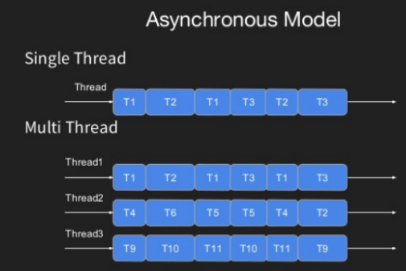

# What is Blocking ?
- Blocking là việc chặn để đợi công việc đang thực hiện hoàn trước khi chuyển sang công việc tiếp theo.
- 
- Các công việc đang bị chờ đợi sẽ có thể bị Failure khi chờ đợi quá lâu ( Ví dụ: Người xếp hàng chờ mua vé quá lâu. Sẽ bỏ đi về vì quá lâu).
# What is NON Blocking ?
- Với Non-blocking các công việc khi bắt đầu thực hiện sẽ không chặn việc thực hiện công việc mới. Các công việc mới có thể được thực hiện ngay lập tức.
  
- Thông thường, sau khi công việc hoàn thành sẽ gửi notification để tiếp tục xử lý logic nếu có sau khi công việc đó hoàn thành.
# I/O (Input / Output)
- I/O là việc giao tiếp giữa các hệ thống xử lý thông tin.
- Trong đó Input là 1 tín hiệu hoặc dữ liệu mà hệ thống nhận được. Output là các tín hiệu hoặc dữ liệu mà hệ thống đó gửi đi.
### Ví dụ giữa con người, bàn phím, máy tính và màn hình :
- Con người thực hiện hành động click chuột (Với context của chuột thì đây là input của chuột nhận được từ con người, Với context của con người là output của con người)
- Chuột nhận Input từ con người sau đó tiến hành gửi tiến hiệu đến máy tính (Với context của chuột thì việc gửi dữ liệu của chuột đến máy tính là output của chuột , với context của máy tính thì việc nhận data từ chuột gửi đến thì đây là input của máy tính)
- Máy tính nhận Input từ chuột, thực hiện gửi tín hiệu vị trí của chuột đến màn hình (Với context của máy tính việc gửi tín hiệu đến màn hình là output của máy tính, với context của màn hình việc nhận data từ máy tính thì là input của màn hình)
- Màn hình nhận input từ máy tính , thực hiện hiển thị vị trí chuột trên màn hình cho con người nhìn (Với context của màn hình việc hiển thị vị trí chuột mới là output của màn hình, với context của con người vị trí chuột mới trên màn hình là input của con người)

## Lưu ý:
- Với 1 tín hiệu thì tùy từng context nó sẽ là input hay là output. 
- Ví dụ 1: Tin hiệu gửi dữ liệu từ chuột đến máy tính
```
- Với context của chuột thì tín hiệu đấy là output của chuột
- Với context của máy tính thì tín hiệu đấy là input của máy tính
```
- Ví dụ 2: Có 2 Service A và B, Anh call http request đến B
```
- Với context của A thì A đang gửi output đến cho B với 1 số tín hiệu thông tin
- Với context của B thì B đang nhận được một input thông tin từ A.
```
# Blocking I/O
- Blocking i/O là việc chặn các công việc I/O được thực hiện hoàn thành trước khi thực hiện các công việc khác.
- Blocking i/O là việc kết hợp ý tưởng của 2 khái niệm Blocking và i/O.
- Nếu công việc không liên quan gì đến IO thì nó không được gọi là Blocking i/O
### Ví dụ
- Một công việc của chúng ta có 3 việc nhỏ. (Tính 1+1, lưu vào data base, tính 1+1 = 2)
- Tại công việc nhỏ thứ 2, chúng ta IO đến database. Nếu tại thời điểm này bị blocking cho việc chờ kết quả Io database thì được gọi là Blocknig I/O
# NON Blocking I/O
- Cũng tương tự như Blocking i/O đây là việc kết hợp 2 ý tưởng của 2 khái niệm Non Blocking Và I/O
- Non Blocking I/O các công việc I/O khi bắt đầu thực hiện sẽ không chặn thực hiện các công việc mới. Các công việc mới có thể thực hiện ngay lập tức
### Ví dụ 1
- Giống ví dụ ở Blocking I/O: Một công việc của chúng ta có 3 việc nhỏ. (Tính 1+1, lưu vào data base, tính 1+1 = 2)
- Tại công việc nhỏ thứ 2 chúng ta IO đến database, tại thờ điểm này chúng ta sẽ tiếp tục thực hiện các công việc khác mà không đợi database trả về. Sau khi database trả về kết quả chúng ta sẽ xử lý kết quả đó sau.
# Synchronous Asynchronous
- Synchronous và Blocking hoặc Asynchronous và Non-blocking ở 1 số context thì nó sẽ cùng 1 ý nghĩa nhưng ở 1 số context khác ý nghĩa sẽ khác nhau.
- Khái niệm này thường bị các dev  trên mạng coi nó là 1 ý nghĩa, thực chất về ý nghĩa thật sự thì nó sẽ có sự khác nhau.
- Phần các model của Synchronous và Asynchronous không nên mapping quá sâu nó với Logical processors (Hay gọi là Thread trên CPu)
# Synchronous
- Synchronous là 1 quá trình xử lý mà các công việc sẽ phải thực hiện theo trình tự. Bước này rồi mới đến bước đi.
- Ý tưởng của Synchronous đưa ra là mong muốn công việc được thực hiện 1 cách tuần tự.

## 2 loại Synchronous model

### Single
- Khi chỉ có 1 thread, các công việc được thực hiện lần lượt trên thread, các công việc tiếp theo phải chờ công việc trước đó hoàn thành trước khi được thực hiện.
### Multiple
- Chúng ta sẽ có nhiều thread, các công việc được thực hiện trên các thread khác nhau. Giống như Single các công việc tiếp theo của thread dó phải chờ công việc trước đó hoàn thành trước khi được thực hiện.
# Asynchronous
- Với Asynchronous khi có 1 công việc A được thực hiện, các công việc khác có thể được thực hiện ngay lập tức mà không cần đợi công việc A hoàn thành
- ý tưởng của Asynchronous đưa ra là mong muốn các công việc khác có thể được thực hiện ngay mà không cần chạy theo tuần tự.
## 2 loại Asynchronous model

### Single
- Các công việc được thực hiện mà không cần đợi các công việc khác hoàn thành, tuy nhiên tại 1 thời diểm nó vẫn sẽ chỉ thực hiện 1 công việc duy nhất. Nó tương tự như Concurrency
### Multiple
- Các công việc được thực hiện trên các thread khác nhau. Bản chất về tính năng thì nó giống với Single nhưng nó thêm nhiều thread.
# Synchronous I/O
- Đây là việc kết hợp 2 ý tưởng Synchronous và I/O
- Synchronous I/O là quá trình chờ đợi kết quả của quá trình I/O hoàn thành dù thành công hay thất bại trước khi tiếp tục thực hiện công việc mới.

# Asynchronous I/O
- Đây là việc kết hợp 2 ý tưởng Asynchronous và I/O
- Asynchronous I/O là quá trình xử lý mà hệ thống sẽ tiếp tục các công việc khác mà không cần đợi kết quả của quá trình IO.
# So sánh về mặt ý nghĩa của Blocking -> Synchronous và Non-Blocking -> ASynchronous
Blocking | Synchronous
 --- | --- 
Nói đến sự cản trở việc thực thi các công việc tiếp theo (Cản công việc khác thực thi) | Nói đến việc chờ kết quả của công việc để thực hiện công việc tiếp theo (Theo trình tự)

Non-Blocking | ASynchronous
--- | --- 
Nói đến việc khi bắt đầu thực hiện 1 công việc, sẽ không cản trở việc thực hiện các công việc tiếp theo. Các công việc có thể được thực hiện mà không cần đợi bất cứ điều gì (Không bị cản trở) | Nói đến các công việc có thể cùng thực hiện, không có trình tự thực hiện và trình tự kết quả.

