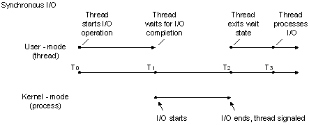
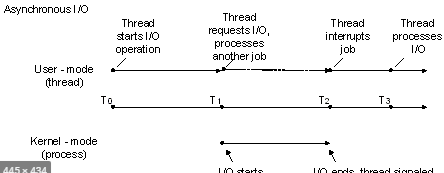

# What is Synchronization  ?
- Synchronization   (Đồng bộ) là  sự phối hợp tất cả các sự kiện để vận hành một hệ thống cùng một lúc.
- Các hệ thống hoạt động với tất cả các bộ phận được Synchronous được gọi là synchronous or in sync
- Các hệ thống điện tử khi sử dụng synchronized  để mong muốn các event có điểm xa nhau có thể  xuất hiện đồng thời hoặc gần như đồng thời.

# Synchronization (computer science)
- Trong khoa học máy tính. Synchronization đề cập đến sự phối hợp của các thread, process  để hoàn thành 1 task với thứ tự chạy chính xác và không có ngoại lệ trình tự không mong  muốn
    - https://en.wikipedia.org/wiki/Synchronization
    - https://en.wikipedia.org/wiki/Race_condition
    - https://en.wikipedia.org/wiki/Synchronization_(computer_science)
    
#### 2 khái niệm chính của Synchronization trong khoa học máy tính là Synchronization of processes và synchronization of data
- synchronization of processes
    - Đề cập đến ý tưởng rằng có nhiều processes cùng tham gia tại một thời điểm để tạo ra một chuỗi các hành động.
- Data synchronization
    - Đề cập đến ý tưởng giữa nhiều bản copies của một tệp data được nhất quán để đảm bảo tính toàn vẹn của dữ liệu
        - Ví dụ: Google driver sync, Version control
        - https://en.wikipedia.org/wiki/Data_synchronization
    

# Synchronous I/O, or blocking I/O
## What is ?
- Khi một thread bắt đầu thao tác I/O, thread sẽ chờ cho đến khi yêu cầu I/O hoàn tất
## Ví dụ
- Khi tìm kiếm dữ liệu trên ổ cứng, hệ thống sẽ cần đợi đĩa quay đến ví trị data sau đó trả về data, sau đó chúng ta sẽ tiếp tục xử lý. Tại thời điểm đĩa quay tìm data, hệ thống của chúng ta sẽ chờ cho đến khi nhận được response.
- 
## Khi nào sử dụng
- Sử dụng khi các task cần phụ thuộc vào kết quả của I/O. Khi đó các task đó cần chờ (block) response của I/O để tiếp tục thực hiện
#Asynchronous I/O
## What is ??
- Trong khoa học máy tính, Asynchronous I/O là 1 dạng khi chờ input và output sẽ phép các process khác tiếp tục chạy trước khi quá trình truyền data kết thúc.
## Ví dụ
- Chúng ta gửi request từ client lên server. Chúng ta sử dụng asynchronous  I/O. Các task vụ cần response data của server vẫn sẽ chờ server trả về (I/O hoàn thành) sau đó mới tiếp tục hoạt đông, nó vẫn bị chặn. Nhưng các task không phụ thuộc vào response của server có thể tiếp tục chạy mà không cần đợi.
- 
## Khi nào sử dụng.
- Khi trong một process của chúng ta có nhiều task. Các có task phụ thuộc Response của I/O có task không phụ thuộc.
# Synchronous programming
## What is ?
- Trong Synchronous programming các task được thực hiện lần lượt và chỉ khi một task hoàn thành thì các task sau mới được bắt đầu thực hiện.
## Ví dụ
- Ví dụ: Javascript là một synchronous, blocking, single-threaded language. Vì nó sync và còn single-thread nên ví dụ chúng ta sử dụng ```alert("Hello World")``` khi chức năng này hiển thị, toàn bộ website sẽ bị kẹt dừng lại cho đến khi chúng ta loại bo cảnh báo.
- Ví dụ 2 : Khi chúng ta sử dụng java web. Mỗi khi người dùng request tomcat sẽ cấp 1 thread mới để sử dụng lý cầu đó của người dùng.
    - Tất cả các task nhỏ trong luồng xử lý yêu cầu đó của khách hàng đểu được thực hiện trên luồng chính được cấp đó. Sẽ có thứ tự giữa các task chạy. Song task trước sẽ đến task sau.
- Ví dụ 3 Với java web chạy trên tomcat server. Mỗi một request từ client gửi lên tomcat sẽ cấp phát 1 thread để tiến hành xử lý request đó. Chỉ khi nào request đó xử lý hoàn tất thì tomcat mới tiếp tục cho thread đó nhận các request khác xử lý.
# Asynchronous programming
## What is ?
- Trong asynchronous programming, từ 1 task to, task sẽ được chia nhỏ thành những task bé chạy trên 1 thread khác độc lập với thread chính.
## Ví dụ
- Ví dụ: Với java web chạy trên tomcat server. Khi client gửi request lên server, response sẽ được trả về ngay lập tức, thông tin request sẽ được cho vào queue để chờ xử lý.
   - Sau khi request xử lý thành công, response data sẽ được trả về thông qua call back.
- Ví dụ về javascript web: Bản chất javascript trên web là single thread tức chỉ có 1 thread xử lý.
   - Tại thời điểm gửi yêu cầu bất đồng bộ lên server, yêu cầu sẽ được chuyển đến cho web APi xử lý và chúng ta sẽ định nghĩa callback. Sau đó thread có thể tiếp tục xử lý các task vụ khác.
       - Sau khi server trả về dữ liệu, callback sẽ được kích hoạt và thread sẽ xử lý response.
